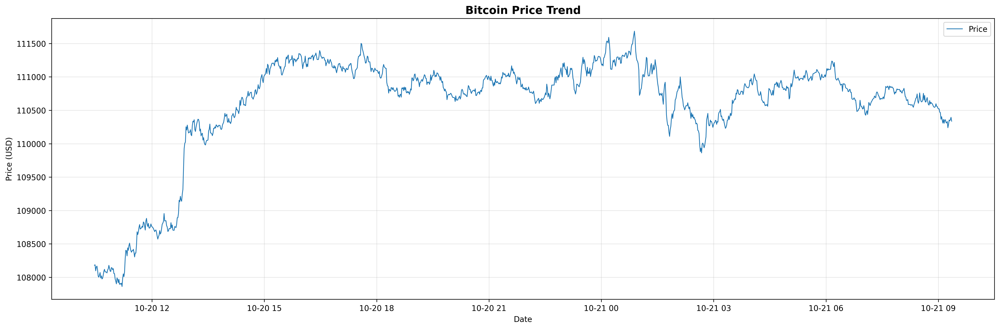

# 📈 BTC Trading Bot

A Python tool for Bitcoin price analysis, visualization, and trading strategies.

## ✨ Features

- **📊 Price Recording** - Live BTC prices from Binance API
- **📉 Visualization** - Generate charts and save images
- **🔍 Pattern Detection** - Find price movements and volatility
- **📈 Trading Strategy** - Moving average crossover signals
- **🔬 Backtesting** - Test strategies with performance metrics
- **📁 Data Export** - Save results to CSV files

---

## 🚀 Quick Start

```bash
# Setup
python3 -m venv venv
source venv/bin/activate
pip install -r requirements.txt

# Record prices
python modules/recorder.py

# Generate charts
python modules/analyzer.py

# Find patterns
python modules/detector.py

# Test strategy
python test_ma_strategy.py
```

---

## 📦 Components

- **`modules/recorder.py`** - Record live BTC prices
- **`modules/analyzer.py`** - Generate price charts
- **`modules/detector.py`** - Find trading patterns
- **`modules/ma_strategy.py`** - Moving average signals
- **`modules/backtester.py`** - Test strategy performance

---

## 📊 Example Output



```
=== BTC Price Patterns ===
  • Morning volatility (6-12): 0.07%
  • Afternoon volatility (12-18): 0.04%
  • Evening volatility (18-24): 0.03%
  • Total price change: +1.96%

=== Backtest Results ===
Initial capital: $1,000,000.00
Final value: $1,019,600.00
Total return: 1.96%
Max drawdown: 0.00%
```

---

## 🛠️ Tech Stack

- **Python 3.8+** - Core language
- **Pandas** - Data analysis
- **Matplotlib** - Charts
- **Requests** - API calls
- **Schedule** - Automation

---

## 📂 Project Structure

```
trading-bot/
├── modules/           # Core modules
├── data/             # Price data
├── charts/           # Generated charts
├── docs/             # Documentation
├── test_*.py         # Tests
├── requirements.txt  # Dependencies
└── README.md         # This file
```

---

## 📖 Documentation

- **[Setup Guide](docs/setup.md)** - Installation instructions
- **[Observations](docs/observations.md)** - Pattern discoveries

---

## ⚠️ Disclaimer

**This tool is for educational purposes only. Not financial advice.**

---

**Built with ❤️ for crypto enthusiasts**

*Last Updated: October 19, 2025*

