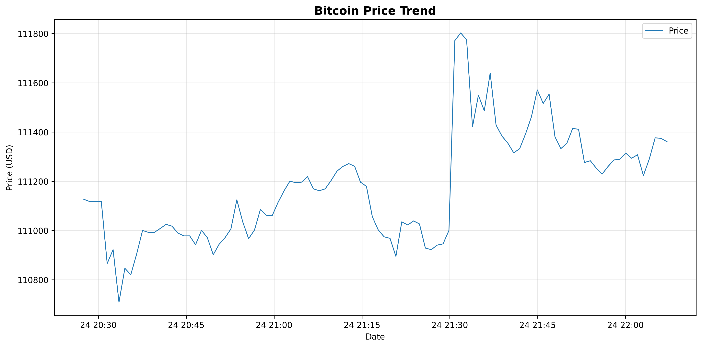

# 📈 BTC Price Trading Bot

A Python-based cryptocurrency price tracking and pattern analysis tool for Bitcoin (BTC). Records live prices, visualizes trends, and detects trading patterns using statistical analysis.

---

## ✨ Features

- **📊 Live Price Recording** - Fetch and store BTC prices from Binance API at custom intervals
- **📉 Price Visualization** - Generate beautiful market cap-style charts with matplotlib
- **🔍 Pattern Detection** - Automatically identify sharp price movements and volatility patterns
- **⏰ Time-based Analysis** - Compare volatility across different time periods (morning/afternoon/evening)
- **📝 Observation Logging** - Document and track discovered patterns over time
- **🔧 Optimized Logging** - Professional logging system with configurable verbosity levels
- **🔄 Data Recovery** - Automatic detection and recovery of missing price data
- **⚡ Performance** - Reduced console output with smart logging intervals

---

## 🚀 Quick Start

```bash
# Clone and navigate to project
cd /home/ubuntu/work/trading-bot

# Setup virtual environment
python3 -m venv venv
source venv/bin/activate

# Install dependencies
pip install -r requirements.txt

# Start recording prices (normal mode)
python recorder.py

# Start recording in quiet mode (minimal logging)
python recorder.py --quiet

# Check for missing data
python recorder.py --check
```

---

## 📦 Components

### 1. Price Recorder (`recorder.py`)
Records live BTC prices from Binance API to CSV files.

```python
from recorder import Recorder

recorder = Recorder(symbol='BTCUSDT', interval=60)
recorder.start()  # Records every 60 seconds
```

### 2. Price Analyzer (`analyzer.py`)
Visualizes price history with professional charts.

```python
from analyzer import Analyzer

analyzer = Analyzer()
df = analyzer.load_and_plot(
    csv_file='data/btc_prices.csv',
    output_image='charts/price_chart.png',
    title='Bitcoin Price Trend'
)
```

### 3. Pattern Detector (`detector.py`)
Identifies trading patterns and market behavior.

```python
from detector import find_pattern
import pandas as pd

df = pd.read_csv('data/btc_prices.csv')
df['timestamp'] = pd.to_datetime(df['timestamp'])
df = df.set_index('timestamp')

patterns = find_pattern(df, jump_threshold=2.0)
for pattern in patterns:
    print(pattern)
```

---

## 📊 Example Output

### Price Chart


### Pattern Analysis
```
=== BTC Price Patterns ===
  • Morning volatility (6-12): 0.07%
  • Afternoon volatility (12-18): 0.04%
  • Evening volatility (18-24): 0.03%
  • Total price change: +1.96%
```

---

## 🛠️ Tech Stack

- **Python 3.8+** - Core programming language
- **Pandas** - Data manipulation and analysis
- **Matplotlib** - Chart visualization
- **Requests** - API calls to Binance
- **Schedule** - Automated price recording

---

## 📂 Project Structure

```
trading-bot/
├── recorder.py          # Price recording module
├── analyzer.py          # Chart visualization module
├── detector.py          # Pattern detection module
├── test_detect.py       # Test suite
├── requirements.txt     # Python dependencies
├── setup.md             # Detailed setup guide
├── observations.md      # Pattern discovery log
├── README.md            # This file
├── .gitignore           # Git ignore rules
├── data/                # Price data storage
│   ├── .gitkeep
│   └── btc_prices.csv
├── charts/              # Generated chart images
│   ├── .gitkeep
│   └── price_chart.png
└── venv/                # Virtual environment
```

---

## 📖 Documentation

- **[Setup Guide](setup.md)** - Complete installation and configuration instructions
- **[Observations](observations.md)** - Documented pattern discoveries and insights

---

## 🔧 Configuration

### Change Recording Interval
```python
recorder = Recorder(
    symbol='BTCUSDT', 
    interval=300,  # Every 5 minutes
    filename='data/btc_prices.csv'
)
```

### Adjust Pattern Sensitivity
```python
patterns = find_pattern(df, jump_threshold=5.0)  # Only detect >5% changes
```

### Use Different API
```python
# In recorder.py, change:
self.api_url = 'https://api.mexc.com/api/v3/ticker/price'
```

### Control Logging Verbosity
```python
# Quiet mode (minimal logging)
recorder = Recorder(verbose=False)

# Normal mode (detailed logging every 5 minutes)
recorder = Recorder(verbose=True)
```

---

## 📈 Use Cases

1. **Price Monitoring** - Track BTC price movements in real-time
2. **Historical Analysis** - Analyze past price trends and patterns
3. **Volatility Research** - Study market behavior across different time periods
4. **Trading Insights** - Identify potential entry/exit points based on patterns
5. **Data Collection** - Build a personal cryptocurrency price database

---

## 🎯 Pattern Detection Features

The bot can detect:
- ✅ Sharp price rises and drops (configurable threshold)
- ✅ Maximum price increases/decreases
- ✅ Time-based volatility patterns
- ✅ Overall price trends
- ✅ Market consolidation phases

---

## 🔄 Typical Workflow

1. **Collect Data** - Run `recorder.py` to gather price data
2. **Visualize Trends** - Use `analyzer.py` to create charts
3. **Detect Patterns** - Run `detector.py` to find trading signals
4. **Document Findings** - Update `observations.md` with insights
5. **Iterate** - Refine thresholds and continue monitoring

---

## 🐛 Troubleshooting

**Virtual environment not working?**
```bash
python3 -m venv venv --clear
source venv/bin/activate
pip install -r requirements.txt
```

**API connection failed?**
- Check internet connection
- Test API: `curl https://api.binance.com/api/v3/ticker/price?symbol=BTCUSDT`
- Try alternative endpoint in `recorder.py`

**Charts not displaying?**
- Charts are saved as PNG files regardless of display
- For SSH sessions, use `ssh -X` for X11 forwarding
- Or comment out `plt.show()` in `analyzer.py`

**Too much console output?**
- Use `python recorder.py --quiet` for minimal logging
- Price updates log every 5 minutes in normal mode
- Use `--check` mode for one-time analysis without continuous logging

For more troubleshooting tips, see [setup.md](setup.md).

---

## 🚧 Future Enhancements

- [ ] Support for multiple cryptocurrencies
- [ ] Moving average crossover detection
- [ ] Support/resistance level identification
- [ ] RSI (Relative Strength Index) calculation
- [ ] Bollinger Bands analysis
- [ ] Email/SMS alerts for significant price movements
- [ ] Web dashboard for real-time monitoring
- [ ] Machine learning price prediction

---

## ⚠️ Disclaimer

**This tool is for educational and research purposes only. It is NOT financial advice.**

- Cryptocurrency trading carries significant risk
- Past performance does not guarantee future results
- Always do your own research before making trading decisions
- The developers are not responsible for any financial losses

---

## 📄 License

This project is for personal use and educational purposes.

---

## 🤝 Contributing

Contributions, issues, and feature requests are welcome!

1. Fork the project
2. Create your feature branch
3. Add tests for new functionality
4. Update documentation
5. Submit a pull request

---

## 📞 Support

- 📚 Check [setup.md](setup.md) for detailed instructions
- 📊 Review [observations.md](observations.md) for pattern insights
- 🧪 Run `python test_detect.py` to verify installation

---

## 🙏 Acknowledgments

- **Binance API** - Real-time cryptocurrency price data
- **Python Community** - Amazing data analysis libraries
- **Open Source** - Standing on the shoulders of giants

---

**Built with ❤️ for crypto enthusiasts and data analysts**

*Last Updated: October 19, 2025*

